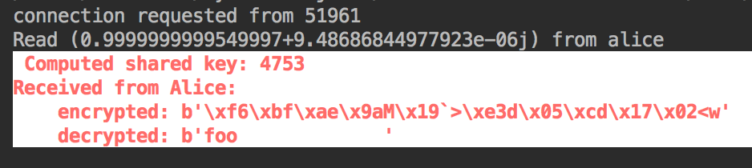
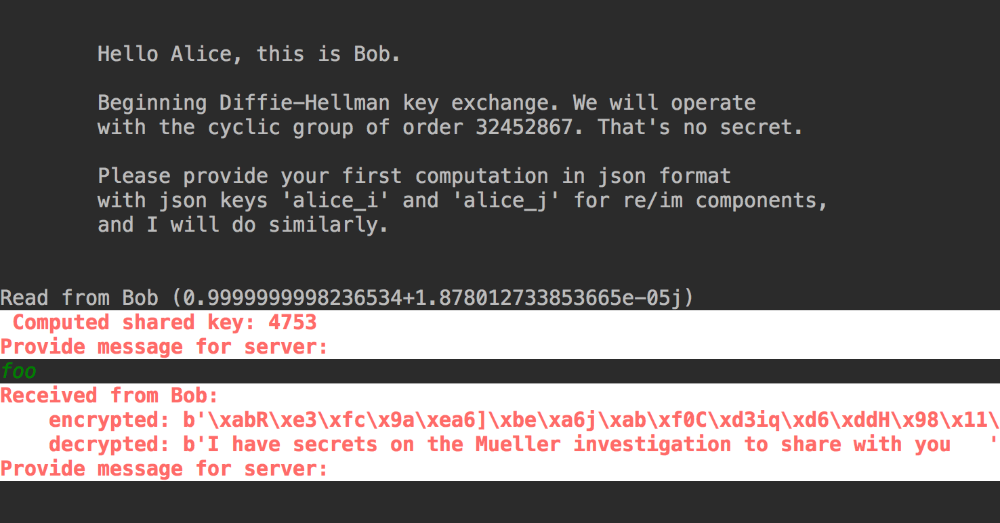

diffie-hellman key exchange
=============

Table of Contents
-----------------
  * [Introduction](#introduction)
  * [Requirements](#requirements)
  * [Usage](#usage)
  * [Notes](#notes)


Introduction
------------

Toy example of client server diffie-hellman key exchange and symmetric encryption of messages. Bob is the server and Alice the client.





Requirements
------------
 * Python 3
 * pycrypto


Usage
----------
Start the server and client:

```sh
python dh_server.py
python dh_client.py
```

Notes
------------------

Let `G` be a cyclic group of order `n`, where `n` is prime, and `g` a generator for `G`. Alice chooses a random integer `a` and sends `g^a` to Bob; Bob does likewise with a random integer `b`. Bob and Alice independently compute `g^ab = g^ba` on their received messages; the result is the shared secret key.

In this implementation the generator `g` is represented as the corresponding root of unity `e^(2 i pi / n)`.